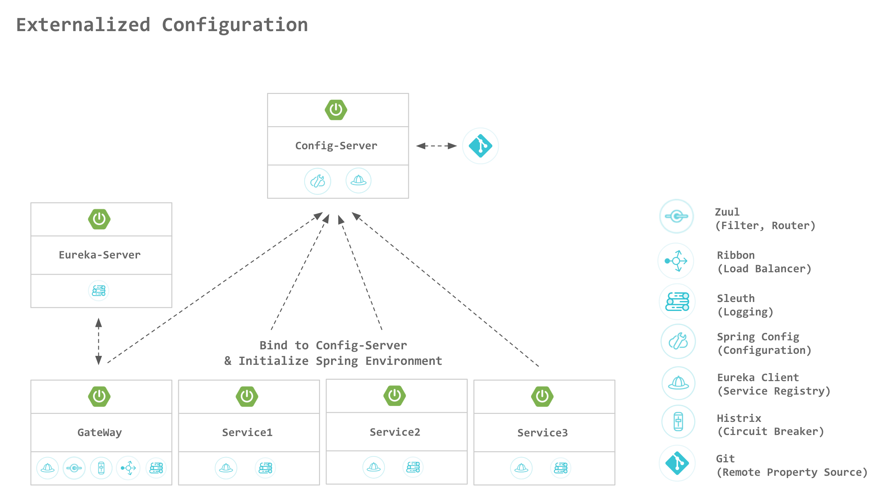

# Spring Cloud Config
> Spring Cloud Config 예제 프로젝트

Spring Cloud Config는 분산 시스템에서 환경설정을 외부로 분리하여 관리할 수 있는 기능을 제공한다.

Config Server를 사용하여 모든 환경(개발, 테스트, 프로덕션 등)에 대한 어플리케이션들의 속성을 한 곳에서 관리할 수 있다.

## Getting started

- System Requirements

  | Type      	| Tool         	| Version      	|
  |-----------	|--------------	|--------------	|
  | Compiler  	| JDK         	| 1.8 이상     	|
  | Builder   	| maven        	| 3.2 이상     	|
  | Framework 	| Spring Boot  	| 2.0.2        	|
  |           	| Spring Cloud 	| Finchley.RELEASE 	|

- Initial Configuration

  - [Configuration git](https://github.com/SDSACT/coe-configurations)

  - {serverId}-{profile}.yml 이름으로 프로퍼티 파일 업로드

- Screenshot

  

## Related Links

- [MSA CoE Guide](https://coe.gitbook.io/guide/config/springcloudconfig)

- [Official site](https://docs.spring.io/spring-boot/docs/current/reference/html/boot-features-external-config.html)
